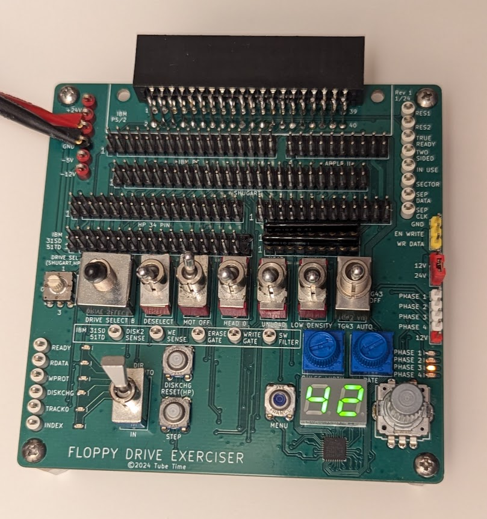

# Floppy Exerciser



This board helps test floppy drives of several different types:

* Standard IBM 34-pin drives (3.5" and 5.25")
* IBM PS/2 40-pin drives with embedded power connections
* Shugart 8" floppy drives
* Apple II (original Disk II)
* HP 34-pin drives (as found in many 9122 enclosures)
* HP 26-pin drives (found in older enclosures and machines)
* IBM 31SD and 51TD floppy drives

The board basically breaks out every signal to a control switch, indicator LED, or test point. It's not designed as a flux imaging tool--it's just a simple way to exercise features of a floppy drive.

There is an optional section of the board that is a step controller for the head stepper motor. This controller has an encoder wheel and a small 7-segment display. It will let you select and automatically step to a particular track.

Features include:

* Two potentiometers control step pulse width and step period (speed)
* Generates TG43 signal (Track greater than 43, for variable write current)
* Alignment mode makes it easy to cycle between track 0, middle, and last track
* Supports half tracking (Apple II) and double tracking modes
* Supports direct stepper motor drive through separate header
* Direct stepper drive supports half track, double track, and 1.5x tracking, useuful for getting 32 tpi from a 48tpi drive
* Auto track 0 seek function will try to locate track 0

The fab files are [here](fab/FloppyExerciserRev2.zip).

The schematic is [here](FloppyExerciser.pdf).

The bill of materials is [here](FloppyExerciser.csv)


## Fabrication notes

The board is 100mm x 100mm, 2 layer, standard 1.6mm thickness.

Use toggle switches, not slide switches, otherwise the silkscreen markings will be reveresed.

Use a 3-position switch for the TG43 switch.

Use SIP sockets for RN1 and RN2 so you can swap in different termination resistor values. I usually use 1K.

Be careful about putting any signals on J2. If EN WRITE gets grounded (the adjacent pin is ground) then it will enable writes on any connected drive, erasing the existing track.

## Connecting Drives

* Apple II: Use connector J12. Apply -12V, +5V, and +12V to the test points on the left side of the board.
* PC: Use connector J6. Apply +5V to the test point on the left side of the board. Connect a Molex connector to the floppy drive for power (+5V and sometimes +12V).
* PS/2: Use connector J11. Apply +5V and +12V to the test points on the left side of the board.
* Shugart: Use connector J9. Apply +5V to the test point on the left side of the board. Connect the drive to power externally (typically +5V, +24V, and 120VAC).
* IBM 31SD/51TD: Use connector J10. The 31SD has fewer pins, line it up with pin 1. Apply +5V, -5V, and +24V to the test points on the left side of the board.
* HP 34-pin: Use connector J7. Apply +5V and +12V to the test points on the left side of the board.
* HP 26-pin: Use connector J8. Apply +5V to the board and external power to the HP drive.

The board can directly drive an external 4-phase stepper motor. Attach the stepper motor to J1 and connect either +12V or +24V power to the test points on the left side, and set jumper J4 to pick the voltage.

## Firmware

### Building the Firmware

The code for the ATMega328PB microcontroller is meant to run without a bootloader and can be built from the command line if you
have installed avr-gcc and avrdude.

```
make
make fuses
make prog
```

Note that the avrdude command lines in the makefile are hard-coded for the usbtiny programmer. You'll want to change that if you have another type of AVR programmer.

The MCU is new enough that your version of avr-gcc and avrdude may not
support it yet, see [here](https://gist.github.com/goncalor/51e1c8038cc058b4379552477255b4e1) for instructions on how to fix that.

The bottom of the board has a standard 6-pin AVR programming header as a surface mount footprint. Since you only need to program it once, you could plug a header into the programmer's cable and physically push it up against the board, or you could temporarily tack-solder it in place. Or just leave it soldered in place and install standoffs in the corners of the board.

### Using the Firmware

On startup, the display will temporarily indicate `HI` and then prompt you for the stepping mode:

* SS - single step
* DS - double step
* HS - half step
* 15 - 1.5x step

Half step mode and 1.5x step are supported on the direct drive stepper motor header and the Apple II header.

Select the mode with the encoder wheel and then push it down to select the option.

The display now indicates the current track. Move the encoder wheel to pick a new track. The display will blink to indicate your desired track. Once you are satisfied with it, push down on the encoder to select that track.

For additional functions, you can push the menu button. Menu options are selected with the encoder wheel:

* HO - Home to track 0. The controller seeks until TRACK0 asserts or it steps by 80 tracks
* A8 - Alignment mode for 80 tracks. In this mode, the encoder switches between track 0, track 39, and track 79
* A7 - Alignment mode for 77 tracks
* A4 - Alignment mode for 40 tracks
* 35 - Alignment mode for 35 tracks

To exit alignment modes, push the menu button.

The board will control the TG43 (track greater than 43) signal used by 8" drives as long as the switch is set to "AUTO".

## Licensing

This work is licensed under a Creative Commons Attribution-ShareAlike 4.0 International License. See [https://creativecommons.org/licenses/by-sa/4.0/](https://creativecommons.org/licenses/by-sa/4.0/).

